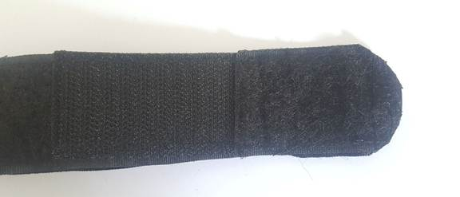

# Bill of materials
* Black self-adhesive hook and loop tape [4 cm width] for the front face of the belt.
* White self-adhesive hook and loop tape [2 cm width] for the windlass strap.
* Polyester cotton webbing strap [4 cm width] for the back face of the belt.
* Nylon heavy webbing strap [2.5 cm width] for the internal belt.
* Double cap rivet
* Polyester thread [0.75 mm thickness]
* Cyanoacrylate glue (Super glue)
* 3D-Printed components.

![[assets/instructions/part6.jpg|width=200px]]

# Assembly instructions
1. Cut all the straps to the required length.
 * Black Self-Adhesive Hook and Loop Tape (Hook: 3 pieces 6 cm each & one piece 15 cm length, Loop: one piece 6 cm, two pieces 12.5 cm, one piece 19 cm)
 * White Self-Adhesive Hook and Loop Tape (Hook:20 cm, Loop: 20 cm) one piece for each.
 * Polyester Cotton Webbing Strap (one piece 97 cm).
 * Nylon Heavy Webbing Strap (one piece 97 cm).

2. For the front face of the belt, sew the straps together sequentially [6 cm Loop, 6cm Hook, 12.5 cm Loop, 6cm Hook, 12.5 cm Loop, 6cm Hook, 19 cm Loop, 15 cm Hook]. Place tip of each piece above the tip of the next piece to facilitate the tensile strength. Sew each connecting point with two passes.

3. Sew the front face of the belt to the back face along one side and leave the other side free to insert the internal belt.

4. Insert the internal belt between the front and back face. Sew the tip of the belt through all pieces so internal belt is anchored to both external belts. Continue sewing with zig-zag setting in an “X” pattern to cover the area 5 cm from the tip.

5. Sew the front face of the belt to the back face. It is very important when sewing the two exterior faces together, that the internal belt remains free to move.

6. Drill two holes through the entire belt at the end of 15 cm hook piece to mount the 3d-printed backing support.

7. Use double cap rivet to fasten the backing plate to the belt through the two holes.

8. Insert the sewn belt tip through 3d-printed windlass clip slot until it reaches the backing support. Take into account keeping the open-end of the clip towards the tip of the belt.

9. Insert the internal belt through the slot in the 3d-printed windlass rod, and then through the slot on the backing support along with the remaining straps.

10. Pull the windlass rod toward windlass clip to maintain extra length of internal belt in the windlass rod area that allows to make tension.

11. Insert the free end of the belt through the toothless slot of the 3d-printed buckle, fold it upwards and back to sew the belt on itself. Taking into account the repetition of sewing across the joint with a couple of passes.

12. Remove any extra threads.

13. Cut the end of the belt in an elliptical shape. Press the tip of the belt to make it easier to insert through the buckle.

14. Sew end of white Hook to the centre point of white Loop to make windlass strap.

15. Use super glue to fasten windlass strap on windlass clip. Hook piece will remain free to wrap over top.

* Note: You can use one Omni tape instead of using separate parts of hook and loop.
