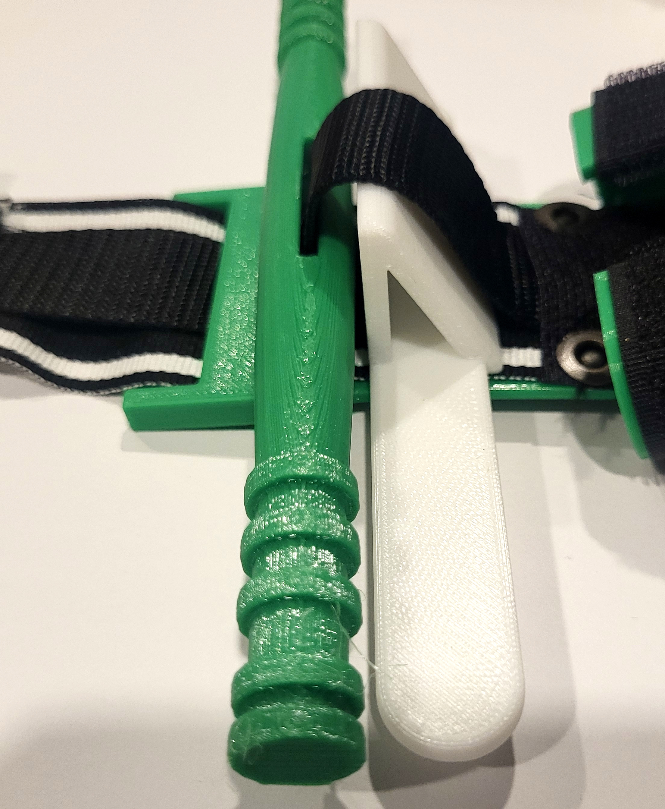
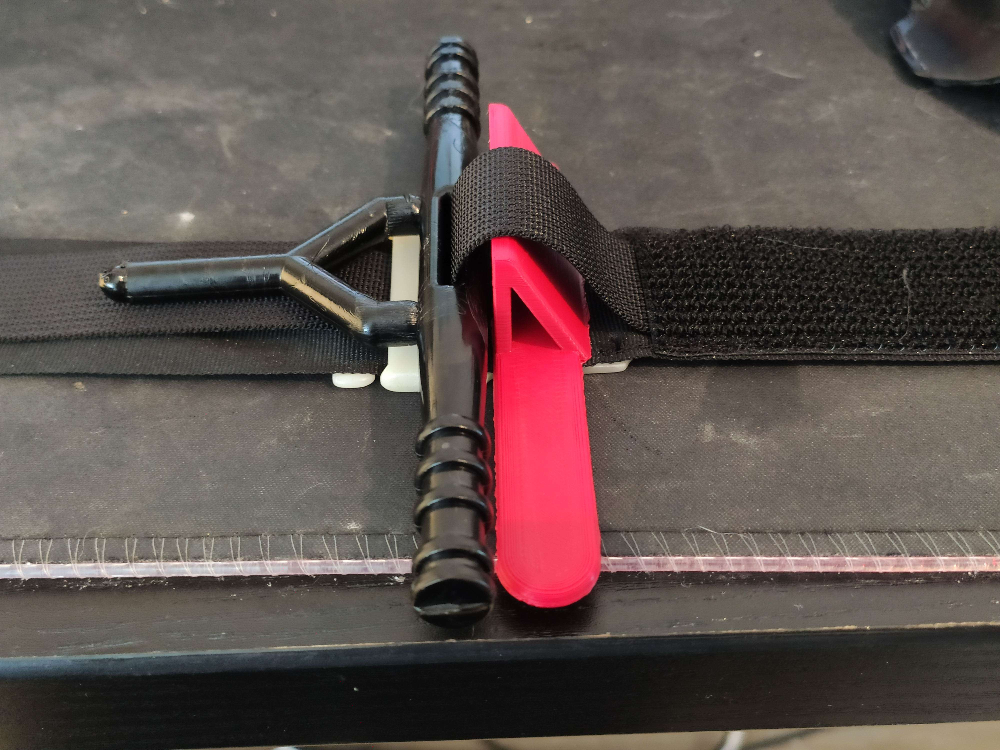

This is a spacer that is used to measure the height of the inner strap above the backplate.

Insert the spacer under the inner strap, face the slope side of the triangle towards the velcro part of the strap.
The windlass should be placed on top of the backplate, with the windlass hole facing upwards, touching the spacer from the perpendicular / vertical side. 
The spacer should be touching the raised backplate section, and should be flat on the outer strap. 
Pull the inner strap tight with the spacer in place, it should set the appropriate slack of the inner strap. 

The material and printing settings do not matter as long as the dimensions of the spacer are accurate.
This part is a tool, not an integral element of the tourniquet and does not need to meet the rigidity requirements of the windlass, backplate, buckle or clip.
 