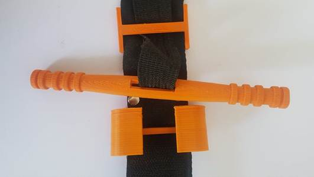

# Bill of materials REVISED
* Black hook and loop tape (Velcro) [3.5-3.85 cm width] for the front face of the belt
* White hook and loop tape (Velcro) [2 cm width] for the windlass clip strap
* Polyester cotton webbing strap [3.5-3.85 cm width, ~1.5 mm thickness] for the back face of the belt
* Nylon heavy-duty non-stretch webbing strap [2.5 cm width, ~1.3 mm thickness] for the internal belt
* Double cap rivets 7mm head
* Polyester thread [0.75 mm thickness]
* Cyanoacrylate glue (Super glue) for ABS or two-part epoxy glue for PETG
* 3D-Printed components

# Assembly instructions
1. Cut all the straps and hook and loop (Velcro) pieces to the required lengths.
 * Black hook and loop (Velcro) (Hook: 3 pieces 6 cm each & one piece 15 cm length, Loop: one piece 6 cm, two pieces 12.5 cm, one piece 19 cm)
 * White Self-Adhesive Hook and Loop Tape (Hook: 20 cm, Loop: 20 cm) one piece for each.
 * Polyester Cotton Webbing Strap (one piece 97 cm).
 * Nylon Heavy Webbing Strap (one piece 97 cm).

2. For the front face of the belt, sew the hook and loop (Velcro) pieces together sequentially [6 cm Loop, 6cm Hook, 12.5 cm Loop, 6cm Hook, 12.5 cm Loop, 6cm Hook, 19 cm Loop, 15 cm Hook]. Overlap each piece by 5mm and sew across each connecting joint with two passes. On the second pass, use a zig-zag stich to flatten the overlap. This sew pattern will allow the belt to slide through the buckle.

3. Sew hook and loop (Velcro) assembly to the piece of strap for the back face. Sew both together along the full length of one side. Leave the other side and the ends open to insert the internal belt.

4. Sandwich the internal belt between the hook and loop (Velcro) strap and back face. Bring the tip of all three pieces flush at one end. Sew across width 3cm from end so internal belt is anchored to both external pieces. Sew an “X” pattern from the previous stitch at 3cm to a point at 5cm.

5. Trim the tip to a rounded shape and sew the belt closed over the entire length. It is very important when sewing the two exterior faces together, that the internal belt remains free to move and is not caught along the side stitching.

6. Drill or punch two holes through the entire belt assembly at the end of 15 cm hook and loop (Velcro) piece to mount the 3d-printed backing plate. Hook and loop (Velcro) strap will overlap onto backing plate by 15mm.

7. Use double cap rivet to fasten the backing plate to the belt through the two holes.

8. Insert the sewn belt tip through slot in 3d-printed clip until it reaches the backing support. Take into account keeping the closed-end of the clip towards the backing plate.

9. Insert the internal belt through the slot in the 3d-printed windlass rod, and then through the slot on the backing support along with the remaining strap.

10. With windlass in place, leave visible slack on the internal belt so that the windlass sits 25-30mm above the backing plate.

11. To insert the free end of the belt through the toothless slot of the 3d-printed buckle, insert upwards through slot then fold back onto itself. The edge of the bridge on the backing plate should sit approximately 3 cm (2.5-3.5 cm) from the stitch fixing the buckle. Sew the strap together with a couple of passes. Trim off any extra material.

12. Remove any extra threads to clean up edges.

13. Ensure rounded tip of belt is stitched closed.

14. Sew end of white Hook to the centre point of white Loop to make strap for windlass clip.

15. Use super glue to fasten windlass strap on windlass clip. Hook piece will remain free to wrap over top. Super glue intended for use on ABS.

* Note: You can use one Omni tape for the long belt instead of using separate parts of hook and loop (Velcro).
# Troubleshooting
1. If you find it hard to sew the velcro tapes together, you can first stick them onto a long piece of masking tape, then sew, then rip off the masking tape.
