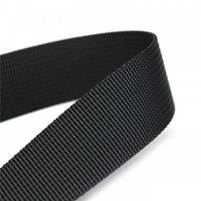
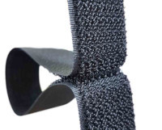
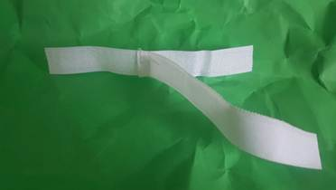
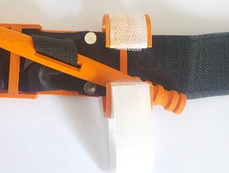

# Nomenclature des matériaux
* Bande auto-agrippante noire (Velcro) [largeur 4 cm] pour la face avant de la ceinture.
* Bande auto-agrippante blanche (Velcro) [largeur 2 cm] pour la sangle du clip du guindeau.
* Sangle en toile de coton polyester [largeur 4 cm] pour la face arrière de la ceinture.
* Sangle en nylon résistant non extensible [largeur de 2,5 cm] pour la ceinture interne.
* Rivets avec double bouchon 7mm tête.
* Fil polyester [épaisseur 0,75 mm].
* Colle cyanoacrylate (Super glue).
* Composants imprimés en 3D.

# Instructions de montage
1. Coupez toutes les sangles et les pièces auto-agrippantes (Velcro) aux longueurs requises.
 * Crochet et boucle noirs (Velcro) (Crochet : 3 pièces de 6 cm chacune et une pièce de 15 cm de longueur, boucle : une pièce de 6 cm, deux pièces de 12,5 cm, une pièce de 19 cm)
 * Ruban auto-adhésif blanc à boucles et crochets (crochet : 20 cm, boucle : 20 cm) une pièce pour chacune
 * Sangle en toile de coton polyester (une pièce 97 cm)
 * Sangle en nylon épais (une pièce de 97 cm)

2. Pour la face avant de la ceinture, cousez les morceaux de crochet et de boucle (Velcro) ensemble dans l'ordre [boucle de 6 cm, crochet de 6 cm, boucle de 12,5 cm, crochet de 6 cm, boucle de 12,5 cm, crochet de 6 cm, boucle de 19 cm, crochet de 15 cm]. Superposez chaque pièce de 5 mm et cousez sur chaque joint de connexion en deux passes pour une résistance à la traction accrue.

3. Cousez le crochet et la boucle (Velcro) sur le morceau de sangle pour la face arrière. Cousez les deux ensembles sur toute la longueur d'un côté. Laissez l'autre côté et les extrémités ouvertes pour insérer la ceinture interne.

4. Placez la ceinture interne entre la sangle auto-agrippante (Velcro) et la face arrière. Amenez la pointe des trois pièces au ras d'une extrémité. Cousez sur la largeur à 3 cm de l'extrémité pour que la ceinture interne soit ancrée aux deux pièces externes. Cousez un motif en « X » du point précédent à 3 cm jusqu'à un point à 5 cm.

5. Coupez la pointe en forme arrondie et cousez la ceinture fermée sur toute la longueur. Lors de la couture des deux faces extérieures, il est très important que la ceinture intérieure reste libre de ses mouvements et ne soit pas coincée le long des coutures latérales.

6. Percez ou cognez deux trous à travers l'ensemble de la ceinture à l'extrémité d'une pièce de crochet et de boucle (Velcro) de 15 cm pour monter la plaque de support imprimée en 3d. La sangle auto-agrippante (Velcro) se chevauchera sur la plaque de support de 15 mm.

7. Utilisez un rivet à double capuchon pour fixer la plaque de support à la ceinture à travers les deux trous.

8. Insérez la pointe de la ceinture cousue dans la fente du clip imprimé en 3D jusqu'à ce qu'elle atteigne le support arrière. Tenez compte de garder l'extrémité fermée du clip vers la plaque de support.

9. Insérez la ceinture interne dans la fente de la tige de guindeau imprimée en 3d, puis dans la fente du support arrière avec la sangle restante.

10. Avec le guindeau en place, reprenez le mou de la ceinture ou de la sangle.

11. Pour insérer l'extrémité libre de la ceinture à travers la fente sans dents de la boucle imprimée en 3d, insérez vers le haut à travers la fente puis repliez-la sur elle-même. La boucle doit reposer à environ 3 cm du bord de la plaque de support. Cousez la sangle avec quelques passages. Coupez tout matériau supplémentaire.

12. Retirez tous les fils supplémentaires pour nettoyer les bords.

13. Assurez-vous que l'extrémité arrondie de la ceinture est cousue fermée.

14. Cousez l'extrémité du crochet blanc au point central de la boucle blanche pour faire la sangle du clip du guindeau.

15. Utilisez de la super glue pour fixer la sangle du guindeau sur le clip du guindeau. Le morceau de crochet restera libre pour s'enrouler sur le dessus. Super glue est à  utiliser sur l'ABS.

* Remarque : vous pouvez utiliser une bande Omni pour la ceinture longue au lieu d'utiliser des parties séparées de crochet et de boucle (Velcro).
