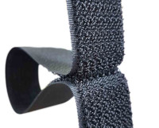
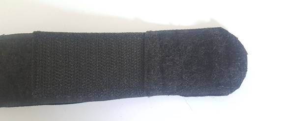
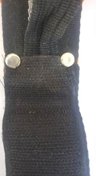
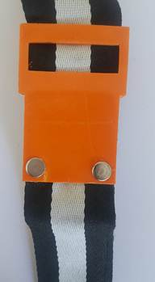
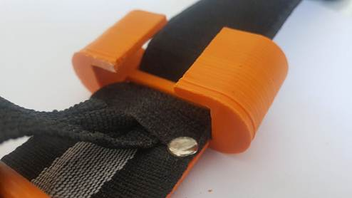
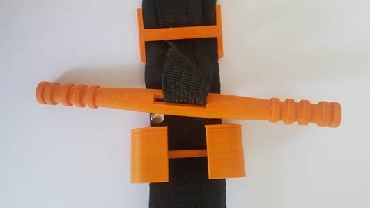
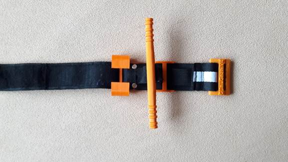
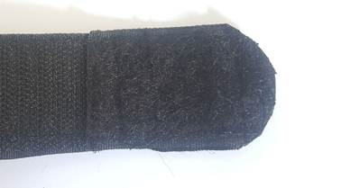
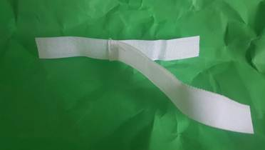
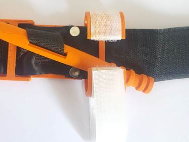

# Lista potrzebnych materiałów:
* Czarna taśma rzepowa (o szerokości 3,5-3,85cm) przeznaczona na przednią część paska
* Biała taśma rzepowa (o szerokości 2cm) przeznaczona na pasek do wyciągarki
* Poliestrowo-bawełniany pas parciany (o szerokości 3,5-3,85cm) przeznaczony na tylną część paska
* Nylonowy, wytrzymały i nierozciągliwy pas parciany (o szerokości 2,5cm) przeznaczony do wewnętrznej części paska
* Dwustronne nity kaletnicze 7mm
* Nić poliestrowa (o grubości 0,75mm)
* Klej cyjanoakrylowy (typu „Kropelka” lub „Super glue”)
* Elementy wydrukowane w drukarce 3D

# Instrukcja składania:
1. Przytnij wszystkie paski i taśmy rzepowe do wymaganej długości
 * Czarną taśmę rzepową podziel zgodnie z podanymi wymiarami (Dla strony twardej – czyli części przyczepnej taśmy [tzw. haczyków]  utnij 3 fragmenty o długości 6cm oraz jeden fragment o długości 15cm. Dla strony miękkiej – czyli części, do której przyczepia się rzep [tzw. pętelek] utnij 1 fragment o długości 6cm, dwa fragmenty o długości 12,5cm i jeden fragment o długości 19cm)
 * Białą samoprzylepną taśmę rzepową podziel zgodnie z podanymi wymiarami (Dla strony twardej – jeden fragment o długości 20cm. Dla strony miękkiej – jeden fragment o długości 20cm)
 * Z poliestrowo-bawełnianego pasa parcianego utnij jeden fragment o długość 97cm
 * Z nylonowego pasa parcianego utnij jeden fragment o długość 97cm

2. Dla przedniej części paska, zszywaj ze sobą po kolei przygotowane fragmenty paska rzepowego według podanej kolejności (fragment strony miękkiej o długości 6cm, fragment strony twardej o długości 6cm, fragment strony miękkiej o długości 12,5cm, fragment strony twardej o długości 6cm, fragment strony miękkiej o długości 12,5cm, fragment strony twardej o długości 6cm, fragment strony miękkiej o długości 19cm, fragment strony twardej o długości 15cm). Każdy z fragmentów zszywaj nakładając je na siebie, tworząc zakładkę o długości 5mm. Szyj w poprzek każdej zakładki tworząc dwa szwy, aby zwiększyć wytrzymałość paska na rozciąganie.

3. Przygotowany w ten sposób pasek rzepowy połącz z poliestrowo-bawełnianym pasem parcianym, przeznaczonym na tylną część pasa. Zszyj je ze sobą po jednej stronie na całej jej długości. Drugą stronę pasa pozostaw niezszytą, tak, aby możliwe było włożenie do niego wewnętrznej części pasa.

4. Włóż nylonowy pas parciany pomiędzy pasek rzepowy i poliestrowo-bawełniany pas parciany. Doprowadź końcówki wszystkich trzech elementów do jednego końca.  Zszyj je ze sobą w poprzek na wysokości 3cm od końca, tak, by pasek wewnętrzny był przyczepiony do pozostałych dwóch. Następnie wykonaj szew na wzór litery „X” zaczynając od wysokości poprzedniego szwu (czyli 3cm od końca paska) do wysokości 5cm od końca paska.

5. Przytnij końcówkę do zaokrąglonego kształtu i obszyj cały pasek wzdłuż jego długości. Istotne jest przy tym, aby w trakcie zszywania zewnętrznych części paska, nie wszyć się w pasek wewnętrzny, gdyż musi być on w stanie swobodnie się poruszać.

6. Wywierć lub przebij dwa otwory poprzez cały pas na końcu 15 centymetrowego fragmentu paska rzepowego, by zamontować wydrukowany w drukarce 3D wspornik. Pasek rzepowy będzie zachodził na wspornik o 15mm.

7. Użyj dwustronnych nitów kaletniczych aby przymocować wspornik do paska poprzez przygotowane dwa otwory.

8. Włóż zszytą końcówkę paska poprzez szczelinę w wydrukowanym w drukarce 3D klipsie aż dotrze ona do wspornika. Weź pod uwagę, aby zamknięta część klipsa była zwrócona w kierunku wspornika.

9. Przełóż wewnętrzny pasek przez otwór w wydrukowanym w drukarce 3D drążku wyciągarki a następnie poprzez otwór we wsporniku i przeciągnij wzdłuż drugiego paska.

10. Gdy drążek wyciągarki został umieszczony, załóż względem niego pewien luz paska.

11. Aby włożyć wolny koniec paska poprzez bezzębną szczelinę w wydrukowanej w drukarce 3D klamrze, włóż ją skierowaną ku górze poprzez szczelinę, a następnie złóż na siebie. Klamra powinna znajdować się około 3cm od krawędzi wspornika. Następnie, zszyj pasek kilkoma szwami. Dalej, utnij wszelki wystający niepotrzebny materiał.

12. Usuń wszelkie dodatkowe nici, aby wyczyścić krawędzie.

13. Upewnij się, że zaokrąglony koniec paska jest zaszyty.

14. Zszyj koniec twardej strony (tzw. haczyków) białego paska rzepowego w centralnym punkcie miękkiej strony (tzw. pętelek) białego paska rzepowego, aby zrobić pasek dla klipsa wyciągarki.

15. Użyj kleju (typu „Super Glue” lub typu „Kropelka”), aby przymocować utworzony biały pasek do klipsa wyciągarki. Kawałek twardej strony (tzw. haczyków) powinien pozostać swobodny, by móc być owiniętym na wierzchu. Klej typu „Super Glue” przeznaczony jest do klejenia elementów wydrukowanych na podstawie tworzyw ABS.

* Uwaga: Dysponując taśmą typu „Omni tape” (czyli taką, która łączy w sobie część przyczepną – tj. haczyki z częścią miękką – tj. pętelki), możesz użyć jednego fragmentu takiej taśmy na całej długości paska, zamiast stosowania oddzielnych fragmentów taśmy rzepowej.
