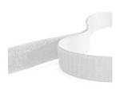
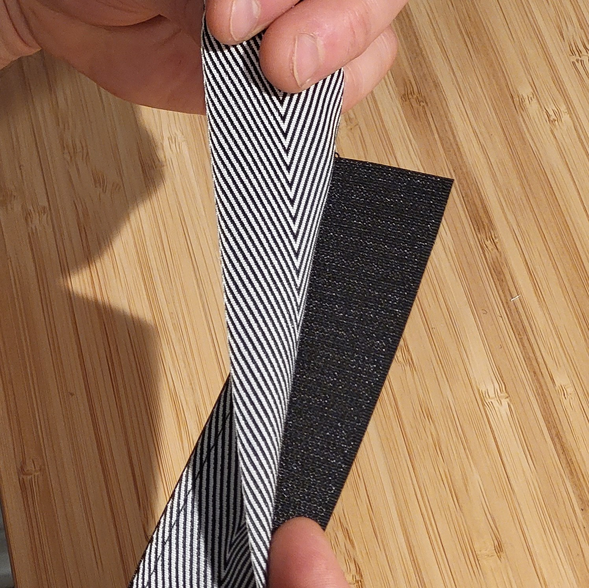
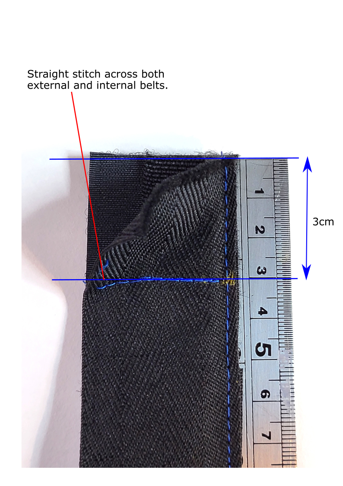
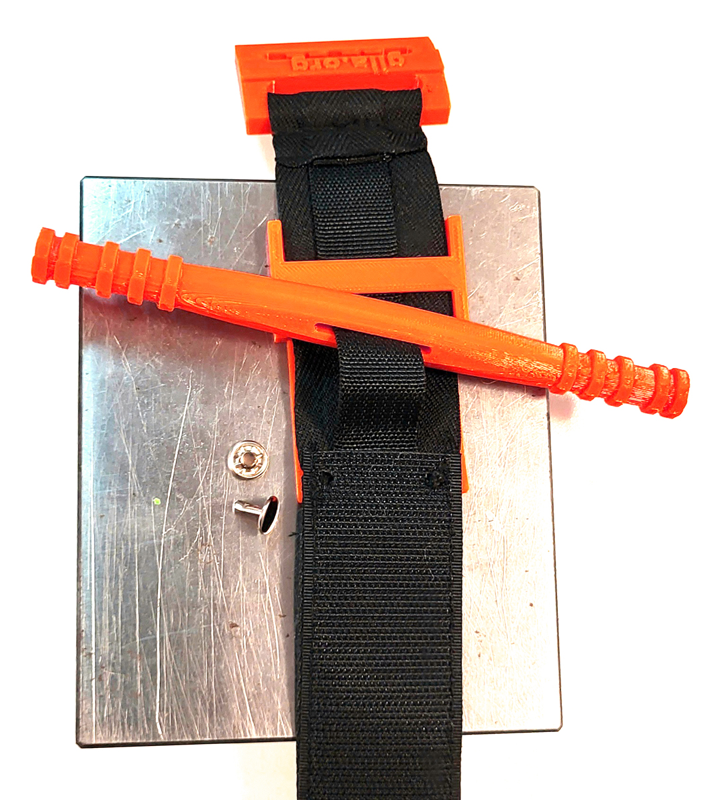
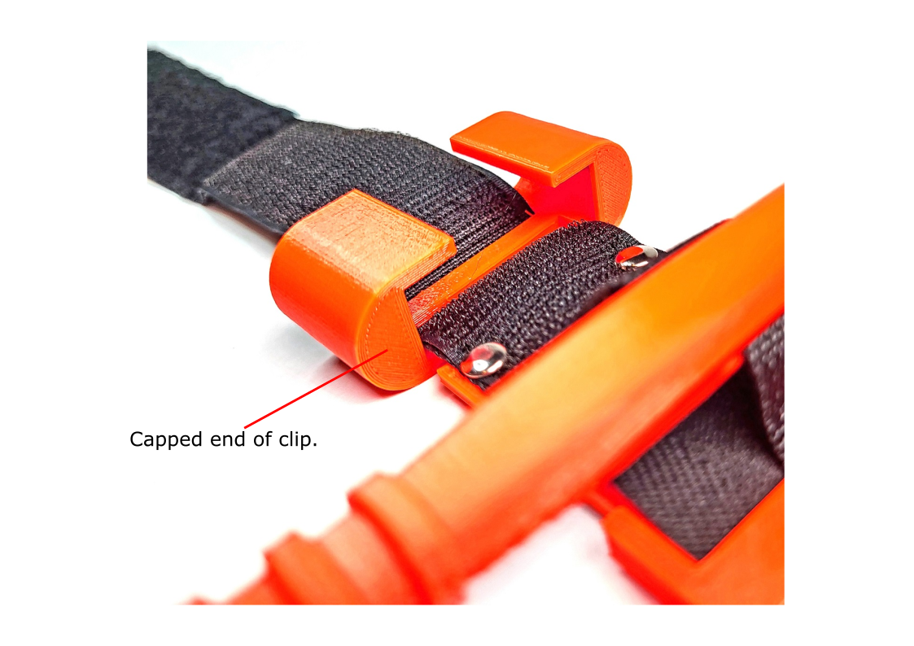
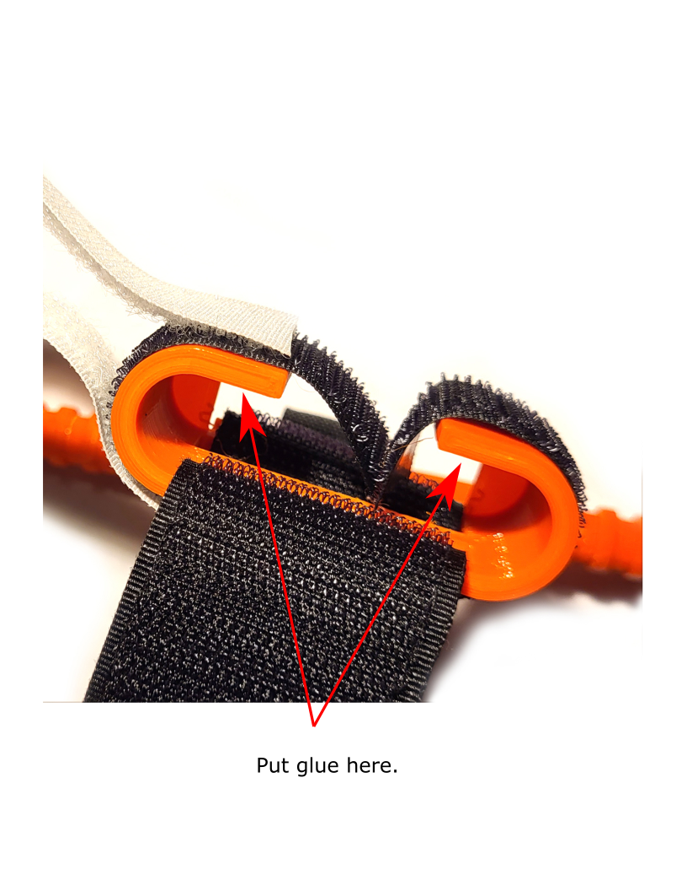
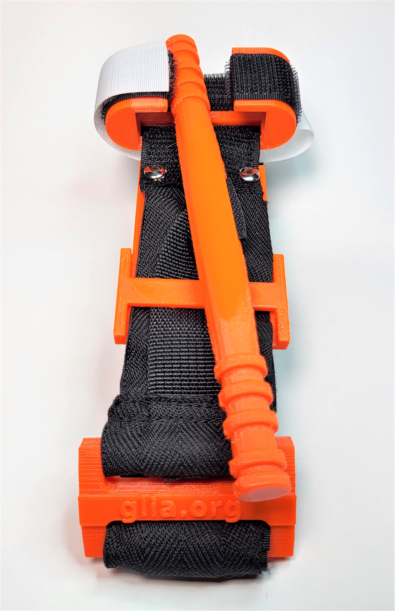

# Lista materiałów

|Czarna taśma rzepowa NIESAMOPRZYLEPNA o szerokości 3,8cm na przednią część paska zewnętrznego|Biała taśma rzepowa SAMOPRZYLEPNA "pętelka" i NIESAMOPRZYLEPNA "haczyk" o szerokości 1,9cm na zaczep|Czarna taśma rypsowa o szerokości 3,8cm i grubości 0,5mm na tylną część paska zewnętrznego|Wojskowa taśma poliamidowa NIEROZCIĄGLIWA o szerokości 1,9cm, i grubości 1mm na pasek wewnętrzny|
|:-------------------------|:-------------------------|:-------------------------|:-------------------------|
|||||

|Dwustronne nity kaletnicze 7mm|Nić poliestrowa w rozmiarze 40 |Cyjanoakrylat (Super Glue/Kropelka) do ABS klej epoksydowy dwuskładnikowy do PETG|
|:-------------------------|:-------------------------|:-------------------------|
||||

||
|:-------------------------|
 Instrukcje i szczegóły odnośnie drukowania części plastikowych do tej opaski zaciskowej znajdują się na profilu GitHub Glii pod linkiem:
https://github.com/GliaX/tourniquet

UWAGI:

1. Dla ścisłości instrukcji wyjaśniamy, że taśma rzepowa składa się z dwóch części. Sztywną i szorstką nazywamy "haczykiem", a miękką i pokrytą meszkiem nazywamy "pętelką". Rozróżnienie to jest bardzo ważne do prawidłowego przycięcia długości pasków.
2. Wahania szerokości pasków o 1-2mm nie mają znaczenia jeśli tylko paski zewnętrzne (rzepowy i rypsowy) nie mają większej szerokości niż 4cm i pasek wewnętrzny nie większą szerokość niż 25mm.
3. W instrukcji posługujemy się następującym nazewnictwem odnośnie części opaski wydrukowanych w technologii 3D: drążek (oryg. windlass), płytka (oryg. backplate), zaczep (oryg. clip) i klamerka (oryg. buckle).  

# Instrukcja montażu
1. Potnij wszystkie paski i rzepy na kawałki o długościach wyszczególnionych w tabeli:

|Materiał|Ilość|Długość|
|:--------------------------------------|:-------------------------|:-------------------------|
|Czarny rzep niesamoprzylepny "haczyk" szerokości 3,8cm|3|6cm|
|Czarny rzep niesamoprzylepny "haczyk" szerokości 3,8cm|1|15cm|
|Czarny rzep niesamoprzylepny "pętelka" szerokości 3,8cm|1|6cm|
|Czarny rzep niesamoprzylepny "pętelka" szerokości 3,8cm|2|12.5cm|
|Czarny rzep niesamoprzylepny "pętelka" szerokości 3,8cm|1|19cm|
|Czarna taśma rypsowa szerokości 3,8cm|1|92cm|
|Wojskowa taśma poliamidowa szerokości 1,9cm |1|95cm|
|Biały rzep samoprzylepny "haczyk" szerokości 1,9cm|1|16cm|
|Biały rzep niesamoprzylepny "pętelka" szerokości 1,9cm|1|17cm|

*Na rysunku oznaczone są: Loop ("pętelka"), Hook ("haczyk"), Nylon Heavy Webbing Strap (wojskowa taśma poliamidowa), Polyester Cotton Webbing Strap (taśma rypsowa). Długości dwóch ostatnich ustalone są na 97cm (niezgodnie z tabelą). Jest to zabieg celowy zwiącany z tym, że kanadyjski oddział Glii stara się produkować swoje paski w myśl idei zero waste. Długości zaznaczone w tabeli pozwalają uszyć pasek pozostawiając mniej ścinków, które potem trzeba wyrzucić. Na początku można jednak zacząć od dłuższych pasków o długości 97cm, gdyż będą one łatwiejsze do uszycia.*

2. Aby uszyć przednią część paska zewnętrznego, najpierw ułóż przycięte paski według długości kolejno: 6cm "pętelka", 6cm "haczyk", 12,5cm "pętelka", 6cm "haczyk", 12,5cm "pętelka", 6cm "haczyk", 9cm "pętelka" i 15cm "haczyk". Kolejność ułożenia pasków pokazana jest na zdjęciu, pierwszy kawałek do zszycia to 6cm "pętelki" i 6cm "haczyka".   

||
|:-------------------------|

3. Zszywaj kawałki kaskadowo, czyli wkładając każdy kolejny kawałek pod spód poprzedniego. Przeszyj ten sam szew kilka razy ściegiem zygzakowym. Kawałki pasków powinny nachodzić na siebie na około 1cm i szew powinien przechodzić przez środek tego nachodzenia, a nie na krawędzi paska. Ten rodzaj szycia zwiększa wytrzymałość na rozciąganie paska i umożliwia bezproblemowe przeciągnięcie go przez klamerkę. Gotowy pasek rzepowy będzie miał około 76cm długości.

4. Do właśnie uszytego paska z rzepów przyszyj pasek rypsowy (3,8cm) ściegiem prostym upewniając się uprzednio, że czepliwa strona rzepów skierowana jest na zewnątrz. Na razie zszyj tylko jedną stronę, drugą pozostaw, by pomiędzy paskami umieścić wewnętrzny pasek z wojskowej taśmy poliamidowej. (Alternatywna metoda umieszczania paska wewnętrznego znajduje się w dodatkowych informacjach pod instrukcją montażu.)

5. Umieść pasek wewnętrzny (1,9cm) w przerwie pomiędzy taśmą rypsową i paskiem z rzepów i przeszyj cały pasek prostopadle ściegiem prostym w ogległości około 3cm od krawędzi paska która zaczyna się 6-ścio centymetrowym kawałkiem rzepu "pętelki". Ma to na celu zamocowanie wewnętrznego paska w środku i przez to ułatwienie dalszego szycia.

6. Naszyj wzmacniający ścieg w kształcie prostokąta z iksem około 5cm od krawędzi paska (2cm od właśnie przeszytego prostopadłego ściegu), następnie przytnij krawędź na okrągło i wykończ zapalniczką ostrożnie przypalając postrzępione nitki.

7. Zaszyj otwartą częśc paska uważając, by w trakcie tej czynności nie przeszyć paska wewnętrznego. **Pasek wewnętrzy bezwzględnie musi pozostać ruchomy!**

8. Przełóż sam wewnętrzny pasek przez otwór w wydrukowanym 3D drążku.

9. Następnie przełóż zewnętrzny i wewnętrzny pasek przez otwór w płytce, upewniając się, że płytka umiejscowiona jest 15mm pod kawałkiem "haczyka" o długości 15cm (jak na zdjęciu przy punkcie 12. instrukcji).

10. Umieść drążek na żeberku płytki i wyciągnij wewnętrzny pasek, tak by wystawał na około 25mm do góry, mierząc od powierzchni płytki.

11. Wolne końce pasków (wewnętrznego i zewnętrznego) przeciągnij przez otwór wydrukowanej 3D klamerki pozbawiony "ząbków". Obróć opaskę na drugą stronę i przeszyj paski razem w odległości 35mm od mostka płytki. **Płytka powinna być usytuowana 15mm pod kawałkiem 15cm rzepu "haczyka" (patrz punkt 12. instrukcji)**

|||
|:--------------------------------------|:-------------------------|

12. Ustaw płytkę pod kawałkiem rzepowego "haczyka" w odległości 15mm od jego krawędzi.

||
|:-------------------------|

13. Przebij dwie dziurki przez sam pasek zewnętrzny **(nie naruszaj paska wewnętrznego)** w miejscu otworów na płytce. Za pomocą 7mm nitów kaletniczych zamocuj płytkę do paska przez właśnie zrobione dziurki.

|||
|:--------------------------------------|:-------------------------|

14. Załóż zaczep na pasek. Zaczep jest usytuowany w taki sposób, że jego otwarta część zawsze skierowana jest w stronę dłuższego końca paska, **a druga strona z pokrywką skierowana jest w stronę klamerki**. Przełóż pasek przez wydrukowany 3D zaczep w dół otworu 1 (slot 1) i w górę otworu 2 (slot 2), jak na zdjęciu poniżej. Przeciągnij klip przez całą długość paska aż oprze się o płytkę.

|||
|:--------------------------------------|:-------------------------|

15. Aby uszyć mocowanie na drążek, weź pozostałe kawałki węższego rzepa 1,9cm i przyszyj jeden z końców białego niesamoprzylepnego rzepa "pętelki" do punktu na środku samoprzylepnego czarnego rzepa "haczyka" (czepliwa strona obu rzepów musi być skierowana w górę, jak na zdjęciu poniżej).

16. Przyklej mocowanie do zaczepu w taki sposób, by czarny rzep "haczyk" oplatał go całkowicie dookoła i zawijał się do spodu. **Użyj cyjanoakrylatu jeśli zaczep został wydrukowany z ABS i żywicy dwuskładnikowej, jeśli zaczep został wydrukowany z PETG** Klej należy nałożyć w niewielkiej ilości od spodu pałąka i następnie zawinąć wolne końce rzepu "haczyka". Rzep "pętelka" pozostaje wolny, tak by dało się go swobownie owinąć na pałąku zaczepu.

|||
|:--------------------------------------|:-------------------------|

17. Aby przygotować opaskę do składania, usytuuj biały rzep "pętelkę" jak na zdjęciu poniżej.

|||
|:--------------------------------------|:-------------------------|

18. Gotowa opaska uciskowa, złożona i gotowa do pakowania. Zobacz nagranie z instrukcją składania [tutaj](https://www.youtube.com/watch?v=CSECJQPJmLw)

||
|:-------------------------|

*Uwaga: Podczas szycia paska zamiast naprzemiennego szycia kawałków "haczyków" i "pętelek" możesz użyć paska Omnitape, czyli rzepu, który na jednej stronie ma zarówno haczyki i pętelki przez co potrafi się przyczepić sam do siebie.*

# Rozwiązywanie problemów
1. Jeśli masz problem ze zszywaniem razem pasków rzepa, spróbuj najpierw nakleić kawałki na długi kawałek taśmy maskującej, przeszyć je razem i na końcu usunąć taśmę.

2. Zawsze upewniaj się, że pasek wewnętrzny może poruszać się swobodnie wewnątrz opaski po zszyciu obu jej końców. Przy obracaniu drążkiem, pasek wewnętrzny powinien się zacieśniać.

3. Nity kaletnicze powinny przechodzić jedynie przez pasek zewnętrzny. Upewnij się, że nity nie przechodzą przez pasek wewnętrzny ani go nie przyszczypują.
  
4. Upewnij się, że zabudowana strona zaczepu (z pokrywką) jest skierowana w stronę klamerki. Umożliwi to poprawne zamocowanie drążka i utrzymanie odpowiedniego ucisku.

# Dodatkowe informacje 
1) **Alternatywna metoda umieszczania paska wewnętrznego w opasce**

*Alternatywna metoda umieszczania paska wewnętrznego w opasce (zamiast kroków 4., 5., 6. i 7. w instrukcji montażu opaski uciskowej.*

1(a). Przyszyj wzdłuż dłuższej krawędzi taśmę rzepową uszytą z kawałków "haczyka" i "pętelki" do taśmy rypsowej o szerokości 3,8cm pozostawiając oba końce paska otwarte, tak by dało się przez nie przeciągnąć pasek wewnętrzny.

|||
|:--------------------------------------|:-------------------------|

1(b). Zamocuj jeden koniec paska wewnętrznego do końca wąskiego kijka, o takiej samej lub większej długości od paska wewnętrznego.

||
|:-------------------------|
1(c). Wsuń koniec kijka z zamocowanym paskiem wewnętrznym do paska zewnętrznego przez całą jego długość, aż pokaże się z drugiej strony, następnie odczep od kijka pasek wewnętrzny i wyciągnij kijek z paska zewnętrznego, pozostawiając pasek wewnętrzny w środku.

|||
|:--------------------------------------|:-------------------------|

1(d). Wykonaj ścieg prostopadle do dłuższej krawędzi paska przez wszystkie jego warstwy w odległości 3cm od końca kawałka 6cm "pętelki", zaczepiając tym samym pasek wewnętrzny pomiędzy warstwami rzepa i taśmy rypsowej, jak w punkcie 5. instrukcji montażu opaski uciskowej.

1(e). Kontynuuj od kroku 6. instrukcji, wykonując prostokątny ścieg z iksem w odległości 5 cm od końca paska (2cm od właśnie wykonanego ściegu prostopadłego). Następnie przytnij krawędź na okrągło i ostrożnie przypal odstające nitki zapalniczką.

1(f). Pomiń krok 7. i kontynuuj od kroku 8. instrukcji montażu opaski uciskowej.

