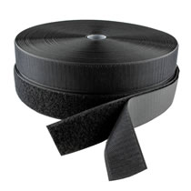
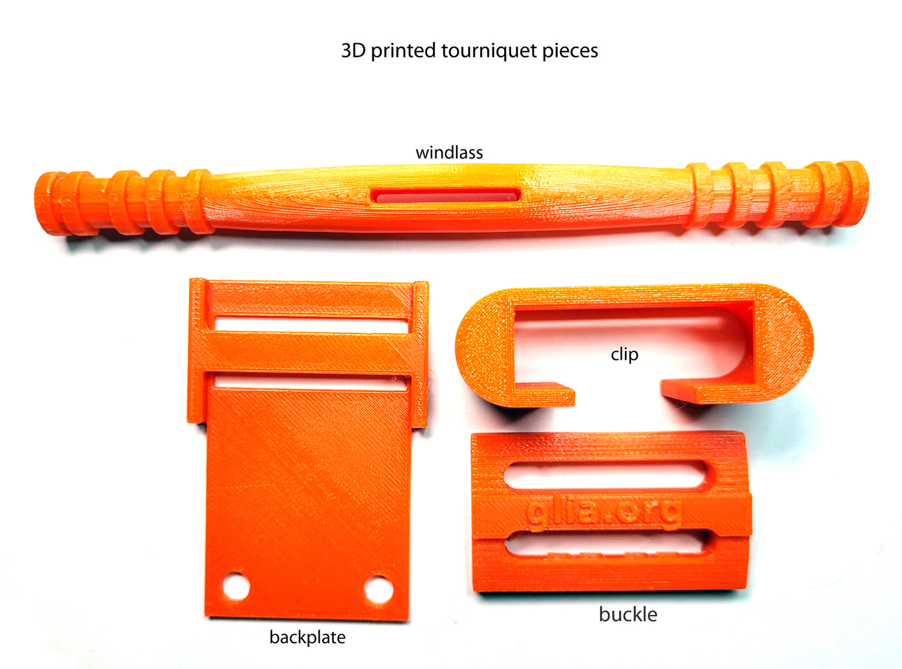
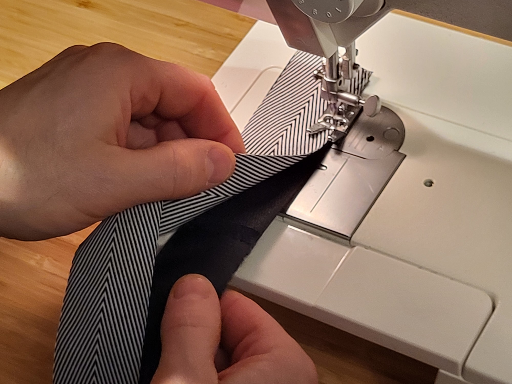
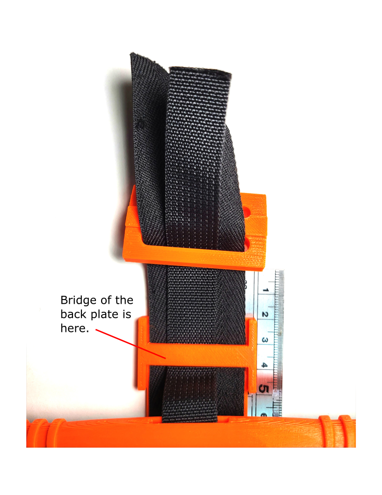
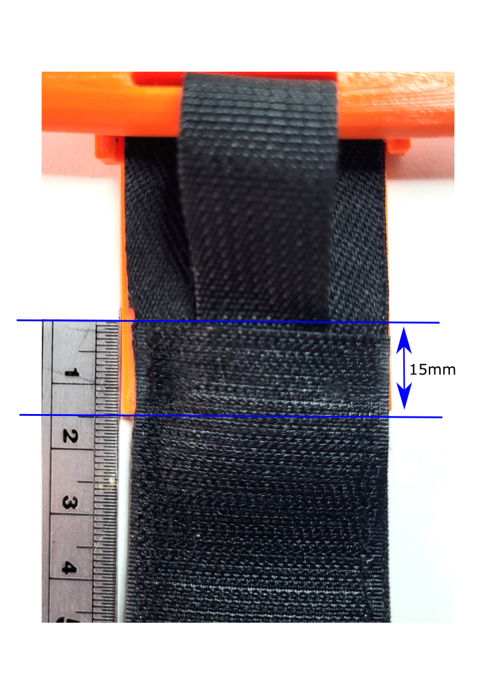
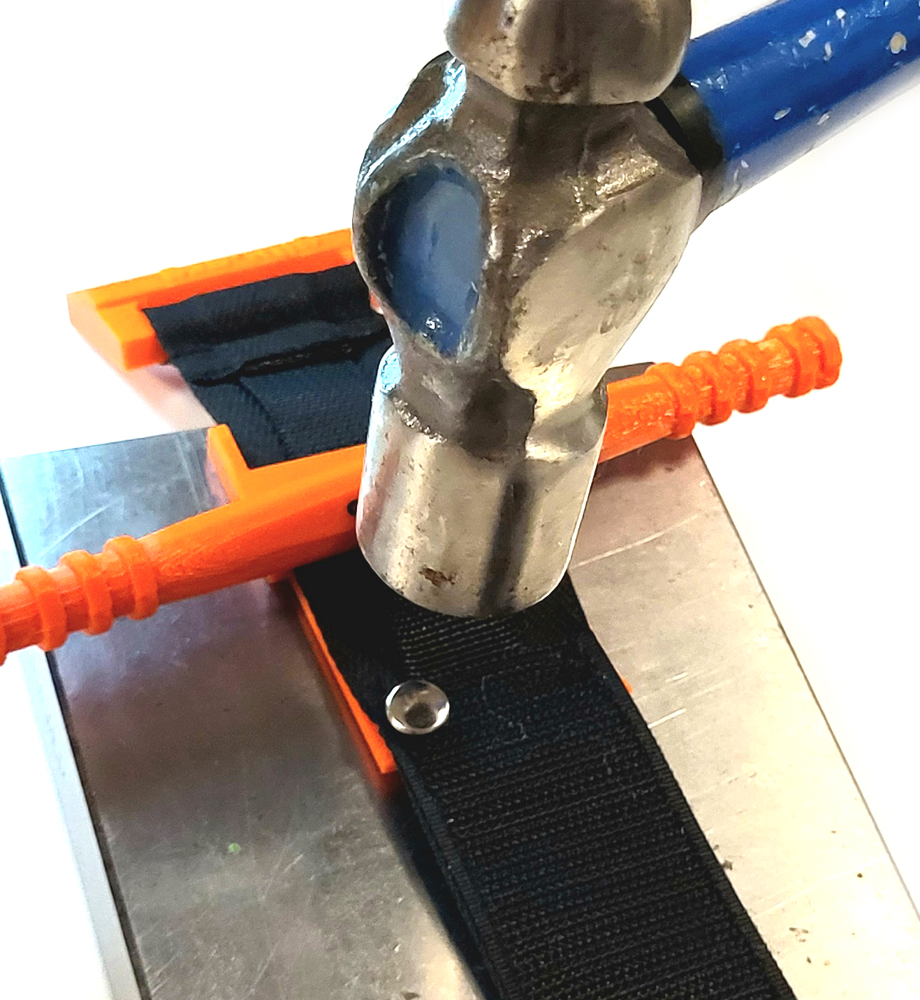
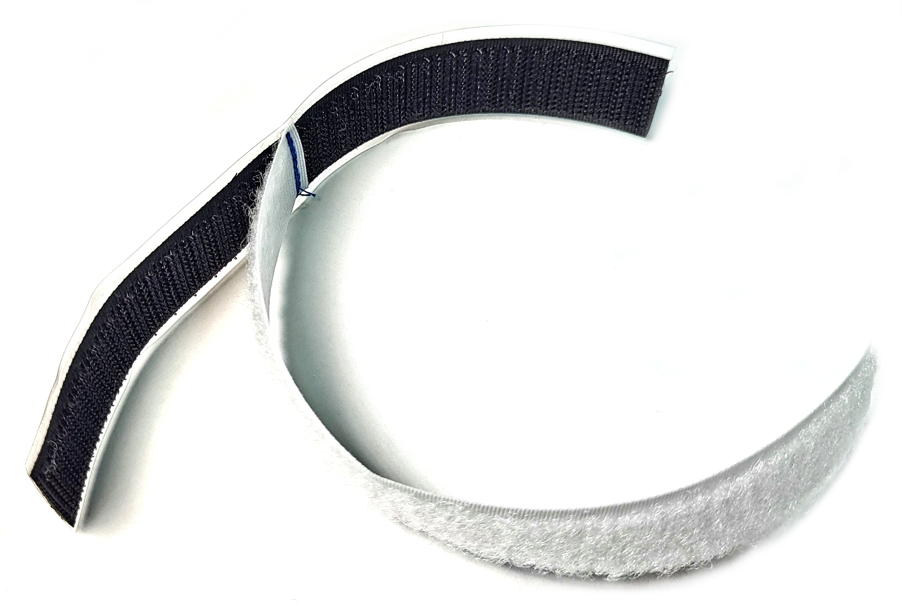
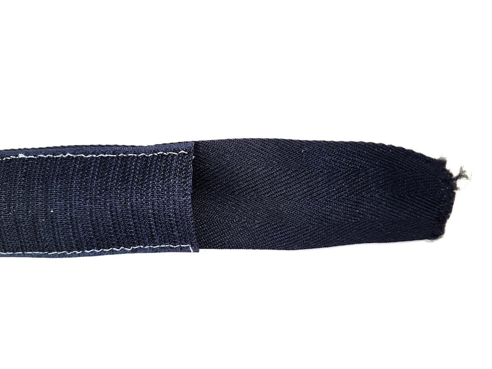

# Lista materiałów

|Czarna taśma rzepowa NIE SAMOPRZYLEPNA o szerokości 3,8cm na przednią część paska zewnętrznego|Biała taśma rzepowa SAMOPRZYLEPNA "pętelka" i NIESAMOPRZYLEPNA "haczyk" o szerokości 1,9cm na zaczep|Czarna taśma rypsowa Strap o szerokości 3,8cm (1.5”), i grubości 0,5mm na tylną część paska zewnętrznego|Wojskowa taśma poliamidowa NIEROZCIĄGLIWA o szerokości 1,9cm, i grubości 1mm na pasek wewnętrzny|
|:-------------------------|:-------------------------|:-------------------------|:-------------------------|
|||||

|Dwustronne nity kaletnicze 7mm|Nić poliestrowa w rozmiarze 40 |Cyjanoakrylat (Super Glue/Kropelka) do ABS klej epoksydowy dwuskładnikowy do PETG|
|:-------------------------|:-------------------------|:-------------------------|
||||

||
|:-------------------------|
 Instrukcje i szczegóły odnośnie drukowania części plastikowych do tej opaski zaciskowej znajdują się na profilu GitHub Glii pod linkiem:
https://github.com/GliaX/tourniquet

UWAGI:

1. Dla ścisłośni instrukcji wyjaśniamy, że taśma rzepowa składa się z dwóch części. Sztywną i szorstką nazywamy "haczykiem", a miękką i pokrytą meszkiem nazywamy "pętelką". Rozróżnienie to jest bardzo ważne do prawidłowego przycięcia długości pasków.
2. Wahania szerokości pasków o 1-2mm nie mają znaczenia jeśli tylko paski zewnętrzne (rzepowy i rypsowy) nie mają większej szerokości niż 4cm i pasek wewnętrzny nie większą szerokość niż 25mm.

# Instrukcja montażu
1. Potnij wszystkie paski i rzepy na kawałki o długościach wyszczególnionych w tabeli:

|Materiał|Ilość|Długość|
|:--------------------------------------|:-------------------------|:-------------------------|
|Czarny rzep niesamoprzylepny "haczyk" szerokości 3,8cm|3|6cm|
|Czarny rzep niesamoprzylepny "haczyk" szerokości 3,8cm|1|15cm|
|Czarny rzep niesamoprzylepny "pętelka" szerokości 3,8cm|1|6cm|
|Czarny rzep niesamoprzylepny "pętelka" szerokości 3,8cm|2|12.5cm|
|Czarny rzep niesamoprzylepny "pętelka" szerokości 3,8cm|1|19cm|
|Czarna taśma rypsowa szerokości 3,8cm|1|92cm|
|Wojskowa taśma poliamidowa szerokości 1,9cm |1|95cm|
|Biały rzep samoprzylepny "haczyk" szerokości 1,9cm|1|16cm|
|Biały rzep niesamoprzylepny "pętelka" szerokości 1,9cm|1|17cm|

*Na rysunku oznaczone są: Loop ("pętelka"), Hook ("haczyk"), Nylon Heavy Webbing strap (wojskowa taśma poliamidowa), Polyester Cotton Webbing Strap (taśma rypsowa). Długości dwóch ostatnich ustalone są na 97cm (niezgodnie z tabelą). Jest to zabieg celowy zwiącany z tym, że kanadyjski oddział Glii stara się produkować swoje paski w myśl idei zero waste. Długości zaznaczone w tabeli pozwalają uszyć pasek pozostawiając mniej ścinków, które potem trzeba wyrzucić. Na początku można jednak zacząć od dłuższych pasków o długości 97cm, gdyż będą one łatwiejsze do uszycia.*

2. Aby uszyć przednią część paska zewnętrznego, najpierw ułóż przycięte paski według długości kolejno: 6cm "pętelka", 6cm "haczyk", 12,5cm "pętelka", 6cm "haczyk", 12,5cm "pętelka", 6cm "haczyk", 9cm "pętelka" i 15cm "haczyk". Kolejność ułożenia pasków pokazana jest na zdjęciu, pierwszy kawałek do zszycia to 6cm "pętelki" i 6cm "haczyka".   

||
|:-------------------------|

3. Zszywaj kawałki kaskadowo, czyli wkładając każdy kolejny kawałek pod spód poprzedniego. Przeszyj ten sam szew kilka razy ściegiem zygzakowym. Kawałki pasków powinny nachodzić na siebie na około 1cm i szew powinien przechodzić przez środek nachodzenia, a nie na krawędzi paska. Ten rodzaj szycia zwiększa wytrzymałość na rozciąganie paska i umożliwia bezproblemowe przeciągnięcie go przez klamerkę. Gotowy pasek rzepowy będzie miał około 76cm długości.

4. Do właśnie uszytego paska z rzepów przyszyj pasek rypsowy (3,8cm) ściegiem prostym upewniając się uprzednio, że czepliwa strona rzepów skierowana jest na zewnątrz. Na razie zszyj tylko jedną stronę, drugą pozostaw, by pomiędzy paskami umieścić wewnętrzny pasek z wojskowej taśmy poliamidowej. (Alternatywna metoda umieszczania paska wewnętrznego znajduje się w adnotacjach pod instrukcją montażu.)

5. Umieść pasek wewnętrzny (1,9cm) w przerwie pomiędzy taśmą rypsową i paskiem z rzepów i przeszyj cały pasek prostopadle ściegiem prostym w ogległości około 3cm od krawędzi paska która zaczyna się 6-ścio centymetrowym kawałkiem rzepu "pętelki". Ma to na celu zamocowanie wewnętrznego paska w środku i przez to ułatwienie dalszego szycia.

6. Sew box stitch 5 cm from end (2 cm from straight stitch across belts), then cut end round and 	sew around the cut edge. Carefully burn off frayed edge of belt.

7. Sew the open side of the exterior belt making sure not to sew the side edge of the internal belt as well. **It is very important that the internal belt remains free to move.**

8. Insert only the internal belt through the slot in the 3d-printed windlass rod.

9. Then insert the internal and external belts through the slot on the back plate, ensuring the orientation of the back plate is 15mm under the 15cm hook piece (see photo at step 12).

10. With the windlass in place, pull the internal belt up to 25 mm above the backing plate.

11. Insert the free end of the belts (both internal and external) through the toothless slot of the 3D printed buckle. Fold over and sew both internal and external belts to themselves 35 mm from the bridge of the back plate. **Back plate should be positioned 15mm under the 15cm hook piece (see step 12).**

|||
|:--------------------------------------|:-------------------------|

12. Position edge of back plate under the piece of hook by 15 mm.

||
|:-------------------------|

13. Punch two holes through the external belt only **(avoid the internal belt)** where the holes are located on the back plate to mount it to the belt. Use a 7 mm head double cap rivet to fasten the back plate to the belt.

|||
|:--------------------------------------|:-------------------------|

14. Put the clip onto the belt. The clip is positioned so that the open end is always pointing toward the long end of the belt, **capped end toward the buckle**. Slide the 3D printed clip onto the belt by 	putting the belt down through slot 1 and up through slot 2, as shown below. Pull the clip along 	length of belt until it reaches the back plate and the belt is taught.

|||
|:--------------------------------------|:-------------------------|

15. To sew the Hoop and Loop assembly to be adhered to the clip, sew the end of the white non-adhesive Loop (face down) to the centre point of adhesive Hook (face up / black in the photo below).

16. Adhere the Hook to the clip (Hook is black in the photos). **Use Cyanoacrylate (Super Glue) to permanently stick this piece onto clip if clip is printed with ABS. Use 90 second epoxy adhesive to stick if clip is printed in PETG.** Glue is applied as a dab under the open ends of the clip to glue the folded over ends of the Hook piece. Loop piece is free to wrap over top.

|||
|:--------------------------------------|:-------------------------|

17. To prepare for folding, position the white Loop piece same as in the photos below.

|||
|:--------------------------------------|:-------------------------|

18. Completed tourniquet, folded and ready for packaging. See folding video [here](https://www.youtube.com/watch?v=CSECJQPJmLw)

||
|:-------------------------|

*Note: You can use one Omni tape for the long belt instead of using separate parts of hook and loop (Velcro).*

# Troubleshooting
1. If you find it difficult to sew the velcro tapes together, first stick them onto a long piece of masking tape, then sew. Rip off the masking tape when done.  

2. Always make sure the internal belt is free to move after anchoring it at both ends. When turning the windlass, the internal belt should tighten.

3. The rivets should only be through the outer strapping. Make sure they are not through, or pinching, the internal belt.
  
4. Make sure the capped end of the clip is facing toward the buckle. This helps secure the windlass in place once it is turned to the appropriate tightness.
# Addendum
1) **Alternative Inner Belt Insertion**

*An alternative method of inserting the internal belt into the external belt (covering steps #4, 5, 6 and 7 in the Tourniquet Assembly Instructions).*

1(a). Sew the Hook and Loop belt to the 4cm external strapping down both long sides leaving both short ends open. This creates a tube in which the internal belt can be inserted into.

|||
|:--------------------------------------|:-------------------------|

1(b). Secure one end of the internal belt to one end of a rod that is the same length (or longer) than the internal belt.

||
|:-------------------------|
1(c). Insert that end into the external belt all the way until it comes out the other end. Then take the rod out leaving the internal belt inside the external belt.

|||
|:--------------------------------------|:-------------------------|

1(d). Sew across the internal and external belts with a straight stitch 3 cm from the end with the small Loop piece, anchoring the internal belt between both sides of the external belt, as in step #5 of the Tourniquet Assembly Instructions.

1(e). Continue with step #6 of the instructions, sewing a box stitch 5 cm from end (2 cm from straight stitch across belts), then cut end round and sew around the cut edge. Carefully burn off frayed edge of belt.

1(f). Skip step #7, and continue on with step #8 of the Tourniquet Assembly	Instructions.

