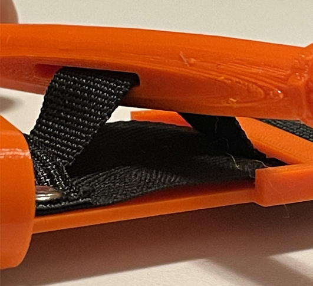

# Lista potrzebnych materiałów:
* Czarna taśma rzepowa (o szerokości 3,5-3,85cm) przeznaczona na przednią część paska
* Biała taśma rzepowa (o szerokości 2cm) przeznaczona na pasek do klipsa wyciągarki
* Poliestrowo-bawełniany pas parciany (o szerokości 3,5-3,85cm i grubości około 1,5mm) przeznaczony na tylną część paska
* Nylonowy, wytrzymały i nierozciągliwy pas parciany (o szerokości 2,5cm i grubości około 1,3mm) przeznaczony do wewnętrznej części paska
* Dwustronne nity kaletnicze 7mm
* Nić poliestrowa (o grubości 0,75mm)
* Klej do mocowania paska do klipsa wyciągarki. Klej cyjanoakrylowy (typu „Kropelka” lub „Super glue”) dla elementów wydrukowanych z tworzywa ABS, albo dwuskładnikowa żywica epoksydowa dla elementów z tworzywa PETG
* Elementy wydrukowane w drukarce 3D

# Instrukcja składania:
1. Przytnij wszystkie paski i taśmy rzepowe do wymaganej długości
 * Czarną taśmę rzepową podziel zgodnie z podanymi wymiarami (Dla strony twardej – czyli części przyczepnej taśmy [tzw. haczyków]  utnij 3 fragmenty o długości 6cm oraz jeden fragment o długości 15cm. Dla strony miękkiej – czyli części, do której przyczepia się rzep [tzw. pętelek] utnij 1 fragment o długości 6cm, dwa fragmenty o długości 12,5cm i jeden fragment o długości 19cm)
 * Białą taśmę rzepową podziel zgodnie z podanymi wymiarami (Dla strony twardej – jeden fragment o długości 20cm. Dla strony miękkiej – jeden fragment o długości 20cm)
 * Z poliestrowo-bawełnianego pasa parcianego utnij jeden fragment o długości 97cm
 * Z nylonowego pasa parcianego utnij jeden fragment o długości 97cm

2. Dla przedniej części paska, zszywaj ze sobą po kolei przygotowane fragmenty paska rzepowego według podanej kolejności (fragment strony miękkiej o długości 6cm, fragment strony twardej o długości 6cm, fragment strony miękkiej o długości 12,5cm, fragment strony twardej o długości 6cm, fragment strony miękkiej o długości 12,5cm, fragment strony twardej o długości 6cm, fragment strony miękkiej o długości 19cm, fragment strony twardej o długości 15cm). Każdy z kolejnych fragmentów zszywaj podkładając jego pod poprzedni, tworząc zakładkę o długości 1cm. Szyj w poprzek każdej zakładki tworząc dwa szwy, aby zwiększyć wytrzymałość paska na rozciąganie. Zrób drugi szew zygzakowaty, aby spłaszczyć nasunięcie. Dzięki temu pas będzie łatwiej przechodzić przez klamrę.

3. Przygotowany w ten sposób pasek rzepowy połącz z poliestrowo-bawełnianym pasem parcianym, przeznaczonym na tylną część pasa. Zszyj je z jednej strony na całej długości. Pozostaw drugą stronę pasa nie zszytą, żeby można było włożyć do środka wytrzymały nylonowy pas parciany.

4. Włóż nylonowy pas parciany pomiędzy rzepowym a poliestrowo-bawełnianym pasami:
  * Doprowadź końcówki wszystkich trzech elementów do jednego końca.
  * Umieść pas nylonowy pośrodku pasów zewnętrznych.

  * Zszyj wszystkie pasy razem w poprzek na odległości 3cm od wspólnego końca, tak, by pasek wewnętrzny został przyczepiony do pozostałych dwóch.

  *  Następnie wykonaj szew na wzór litery „X”, zaczynając od poprzedniego szwu (czyli 3cm od końca paska) do 5cm od końca paska.

5. Przytnij końcówkę do zaokrąglonego kształtu i obszyj cały pasek wzdłuż jego krawędzi. Istotne jest przy tym, aby w trakcie zszywania zewnętrznych części paska, nie wszyć się w pasek wewnętrzny, gdyż musi być on w stanie swobodnie się poruszać.

6. Wywierć lub przebij dwa otwory poprzez cały pas na końcu 15 centymetrowego fragmentu paska rzepowego, by zamontować wydrukowany (w drukarce 3D) wspornik. Pasek rzepowy będzie zachodził na wspornik o 15mm.

7. Użyj dwustronnych nitów kaletniczych aby przymocować wspornik do paska poprzez przygotowane dwa otwory.

8. Włóż zaokrągloną końcówkę paska poprzez szczeliny w wydrukowanym klipsie, aż dotrze on do wspornika. Weź pod uwagę, aby zamknięta część klipsa była zwrócona w kierunku wspornika, tak jak jest pokazane na zdjęciu

9. Przełóż wewnętrzny pasek przez otwór w wydrukowanym drążku wyciągarki, a następnie przeciągnij oba paski poprzez szczeliny we wsporniku.

10. Gdy drążek wyciągarki został nawleczony na wewnętrzny pasek, załóż pewien luz wewnętrznego paska. Tak, aby można było zrobić pół obrotu drążka, przed tym jak krępulec zacznie się zaciskać.

11. Aby włożyć wolny koniec paska poprzez bezzębną szczelinę w wydrukowanej klamrze, włóż ją skierowaną ku górze poprzez szczelinę, a następnie złóż na siebie. Klamra powinna znajdować się około 3cm od krawędzi wspornika. Następnie, zszyj pasek kilkoma szwami. Dalej, utnij wszelki wystający niepotrzebny materiał.

12. Usuń wszelkie dodatkowe nici, aby wyczyścić krawędzie.

13. Upewnij się, że zaokrąglony koniec paska jest dobrze uszyty.

14. Aby utworzyć pasek do klipsa wyciągarki, przyczep koniec twardej strony (tzw. haczyków) białego paska rzepowego do środka  miękkiej strony (tzw. pętelek) białego paska rzepowego. Potem zszyj dwa paski na końcu twardej strony.

15. Przyklej miękką stronę (tzw. pętelki) utworzonego białego paska do klipsa wyciągarki. Kawałek twardej strony (tzw. haczyków) powinien pozostać swobodny, aby mógł być owiniętym na wierzchu.

* Uwaga: Dysponując taśmą typu „Omni tape” (czyli taką, która łączy w sobie część przyczepną – tj. haczyki z częścią miękką – tj. pętelki), możesz użyć jednego fragmentu takiej taśmy na całej długości paska, zamiast używania oddzielnych fragmentów taśmy rzepowej.
* Dla ułatwienia zszycia fragmentów paska rzepowego możesz zastosować taśmę maskującą: przyklej wszystkie fragmenty paska rzepowego na taśmę, zszyj fragmenty, a potem odklej taśmę.
