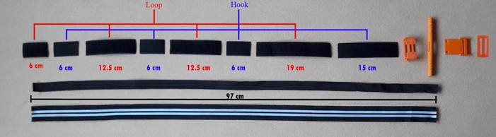
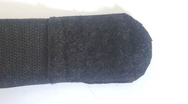

# Список материалов
* Черная лента-липучка шириной 3,5-3,85 см для лицевой стороны ремня, состоит из жесткой (hook)  и мягкой (loop) частей.
* Белая лента-липучка шириной 2 см для клипсы: жесткая и мягкая части.
* Хлопково-полиэстровая тесьма шириной 3,5-3,85 см для тыльной стороны ремня.
* Прочная нерастяжимая нейлоновая тесьма шириной 2,5 см для внутреннего ремня.
* Двухсторонние заклепки с головкой 7 мм.
* Полиэстровая нитка толщиной 0,75 мм для сшивания деталей пояса.
* Суперклей.
* Напечатанные пластиковые детали.

# Инструкция по сбору:
1. Отрежьте ремни необходимой длины, а именно:
  * Черная лента-липучка (жесткая часть: 3 шт. по 6 см и 1 шт. 15 см, мягкая часть: 1 шт. 6 см, 2 шт. 12,5 см каждая, 1 шт. 19 см)
  * Белая лента-липучка (жесткая часть: 1 шт. 20 см, мягкая часть: 1 шт. 20 см)
  * Хлопково-полиэстеровая тесьма (Polyester Cotton Webbing) – 97 см
  * Нерастяжимая нейлоновая тесьма (Nylon Heavy Webbing) – 97 см

2. Чтобы сформировать лицевую сторону ремня, пришейте подготовленные вами черные ленты (липучки) друг к другу в следующей последовательности: 6 см мягкая часть, 6 см жесткая часть, 12,5 см мягкая часть, 6 см жесткая часть, 12,5 см мягкая часть, 6 см жесткая часть, 19 см мягкая часть, 15 см жесткая часть. Важно, чтобы каждый последующий элемент подкладывался под предыдущий. Прошейте каждый соединительный шов двумя проходами для увеличения прочности на разрыв.

3. Лицевая сторона ремня короче тыльной (хлопково-полиэстеровой тесьмы). Выровняйте лицевую и тыльную сторону так, чтобы на общем конце была мягкая часть черной ленты-липучки длиной 6 см. Сшейте лицевую сторону ремня с тыльной по всей длине с одного бока. Оставьте другой бок открытым, чтобы вставить внутренний ремень. 

4. Вставьте внутренний ремень между лицевой и тыльной сторонами ремня, а затем сшейте конец внутреннего ремня с наружными ремнями следующим образом:
  * выровняйте концы внутреннего и наружных ремней
  * внутренний ремень должен находиться по центру относительно наружных ремней

  * прострочите все три ремня (на всю ширину наружных ремней) на расстоянии 3 см от края

  * прострочите крест-накрест наружные ремни с 3ого до 5ого сантиметра от края.

5. Закруглите сшитый конец ремня. Сшейте лицевую и тыльную части ремня с другого бока, так чтобы внутренний ремень мог свободно двигаться внутри.

6. Сделайте два отверстия по бокам с другого края лицевого ремня.

7. Используя заклепки, закрепите опорную пластину на ремне через сделанные отверстия. Внутренний ремень должен свободно двигаться внутри.

8. С закругленного конца проденьте ремень через отверстия клипсы, пока он не достигнет опорной пластины. Обратите внимание, что клипса должна быть повернута узкой стороной к опорной пластине, как показано на фотографии.

9. Вставьте внутренний ремень через отверстие в ручке ворота. Затем проденьте внутренний и тыльный ремни через прорезь опорной пластины.

10. После установки ручки ворота максимально натяните внутренний ремень.

11. Пропустите концы внутреннего и тыльного ремня через беззубчатую прорезь пряжки и пришейте пряжку так, как показано на фотографии. Ремни должны быть сшиты несколькими двойными швами, расстояние от пряжки до опорной пластины должно составить примерно 3 см. Надпись на пряжке должна быть с лицевой стороны ремня.

12. Удалите все лишние нити.

13. Прошейте скругленный конец ремня, чтобы его было легче вставить в пряжку.

14. Застегните белую ленту-липучку сдвинув жесткую часть относительно мягкой примерно на половину длины. Сшейте жесткую и мягкую половинки на конце жесткой части ленты.

15. Приклейте суперклеем мягкую часть ленты-липучки к клипсе. Жесткая лента должна остаться свободной, чтобы ею можно было обернуть клипсу сверху и написать время наложения турникета. Суперклей должен хорошо подходить для пластика ABS.

Обратите внимание: если есть такая возможность, то вместо того, чтобы сшивать лицевую сторону ремня из жестких и мягких отрезков обычной ленты-липучки, можно применить один цельный отрезок ленты типа omni tape. Лента типа omni tape прилипает сама к себе, потому что она сразу сочетает в себе элементы жесткой и мягкой частей на одной и той же стороне (именно на одной стороне, а не мягкая часть с одной стороны, а жесткая с другой).
