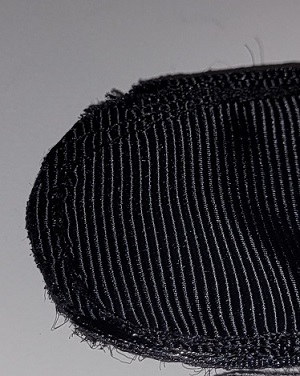
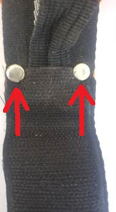
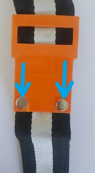
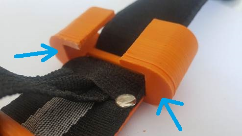
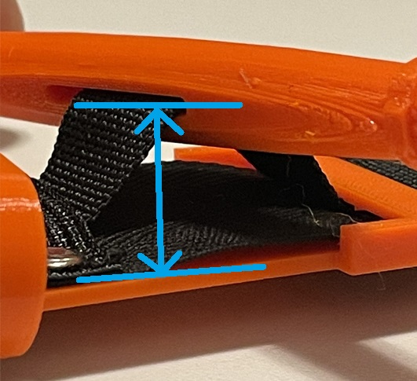
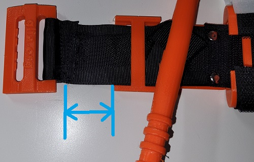
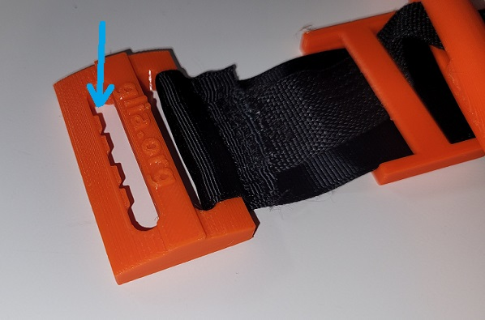

# Kontrola jakości Stazy Glia

Rewizja: **A-PL**

## Historia zmian

|Rewizja|Zmiany od poprzedniej wersji|
|---|---|
|A | Początkowa rewizja - stworzenie dokumentu|
|A-PL | Tłumaczenie na polski|

## Cel dokumentu

Ten dokument zawiera instrukcje kontroli jakości, jej charakterystyki i metodę inspekcji. W prostszych słowach - co trzeba sprawdzić i jak sprawdzić te rzeczy.

## Charakterystyki inspekcji

### IC-0010 (Zakończone szycie)
|Metoda sprawdzenia|Narzędzia potrzebne do sprawdzenia|
|---|---|
|Wizualna|Żadne|

Wszelkie szycie zakończone. Wszystkie luźne nitki muszą być odcięte.

### IC-0020 (Zaokrąglona końcówka paska musi być zapieczona zapalniczką)
|Metoda sprawdzenia|Narzędzia potrzebne do sprawdzenia|
|---|---|
|Wizualna|Żadne|

Zaokrąglona część paska musi być zapieczona zapalniczką.

### IC-0030 (Zaciśnięte nity)
|Metoda sprawdzenia|Narzędzia potrzebne do sprawdzenia|
|---|---|
|Wizualna|Żadne|

Oba nity są mocno zaciśniete i nie są luźne / nie są łatwe do oderwania.

### IC-0040 (Orientacja klipsu)
|Metoda sprawdzenia|Narzędzia potrzebne do sprawdzenia|
|---|---|
|Wizualna|Żadne|

Klips jest zamontowany z "zasklepioną" stroną skierowaną w stronę drążka i sprzączki, a "otwartą" stroną skierowaną w stronę paska.

Notka: "zasklepiony" koniec istnieje żeby nadać struktury klipsowi, nie jest tam by "zasłonić" drążek gdy jest zablokowany. Drążek będzie wystawał przez "otwartą" stronę klipsu podczas poprawnego zastosowania stazy na kończynie.

### IC-0050 (Odległość od płytki do szczeliny drążka)
|Metoda sprawdzenia|Narzędzia potrzebne do sprawdzenia|
|---|---|
|Pomiar długości|Linijka lub bardziej dokładne urządzenie|
t
Odległość między płytką a szczeliną drążka musi wynosić 25mm +/- 2mm.

### IC-0060 (Odległość między mostkiem płytki a szwem sprzączki)
|Metoda sprawdzenia|Narzędzia potrzebne do sprawdzenia|
|---|---|
|Pomiar długości|Linijka lub bardziej dokładne urządzenie|

Dystans między mostkiem płytki a szwem, który zaszywa sprzączkę musi być równy 35mm +/- 2mm.

### IC-0070 (Przewleczenie paska przez sprzączkę, orientacja sprzączki)
|Metoda sprawdzenia|Narzędzia potrzebne do sprawdzenia|
|---|---|
|Wizualna|Żadne|

Pasek musi przechodzić przez niekarbowany otwór w sprzączce. Strona z zębami musi być na samym końcu stazy.

